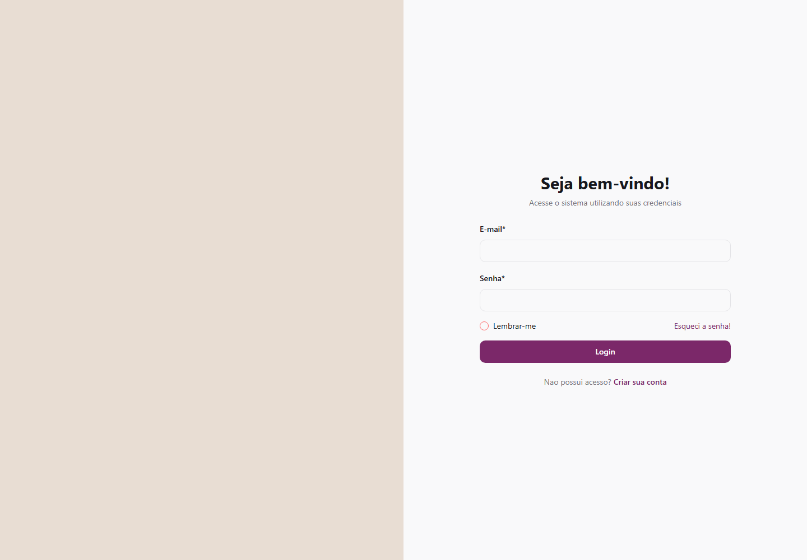
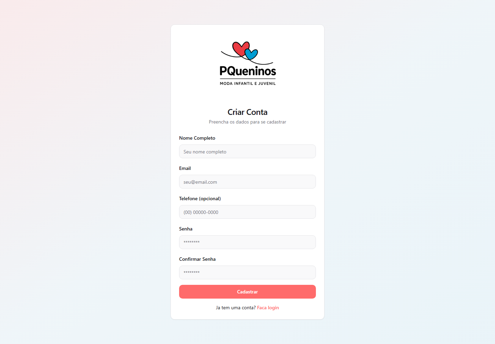
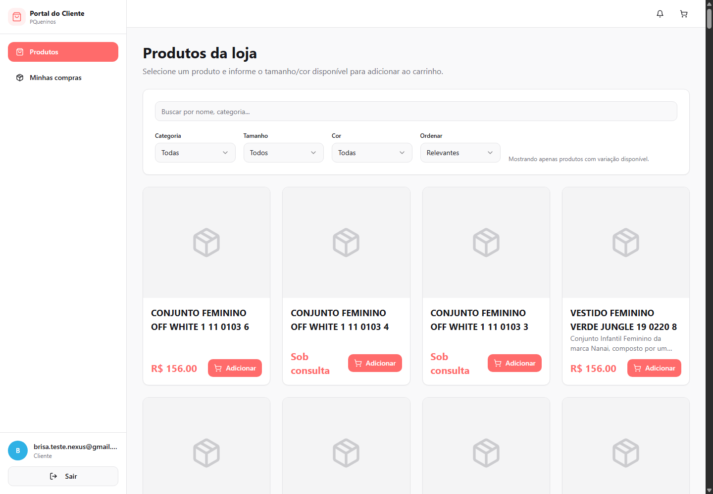

# Nexus Prime

Projeto preparado para entrega a Brisa no processo de bolsa.

O sistema contempla gestao comercial com controle de estoque, clientes, reservas, vendas, pagamentos, relatorios, configuracoes da loja e portal do cliente.

## Equipe e contato

Desenvolvedores:

- Mikael da Cruz - mikaelcruz.aluno@unipampa.edu.br
- Renato M. Couto - renatocouto.aluno@unipampa.edu.br
- Samuel A. F. Monteiro - samuelmonteiro@unipampa.edu.br
- Thiago F. Gomes - thiagogomes.aluno@unipampa.edu.br
- Vinicius N. Lopes - viniciusnunez.aluno@unipampa.edu.br

Orientador:

- Dr. Paulo Cesar C. Aguirre - pauloaguirre@unipampa.edu.br

## Acesso temporario

Enquanto houver creditos disponiveis no servidor temporario, o projeto pode ser acessado em:

https://nexus-prime-build.onrender.com/login

Usuario de teste para avaliacao:

```txt
Email: brisa.teste.nexus@gmail.com
Senha: BrisaTeste123
Perfil: cliente
```

Usuario de teste da empresa:

```txt
Email: empresa.teste.nexus@gmail.com
Senha: EmpresaTeste123
Perfil: administrador da empresa
Empresa: Empresa Teste Nexus
```

Esse usuario tem o mesmo tipo de permissao de administrador de loja usado pela Fernanda, mas vinculado a uma empresa diferente. Ao entrar com o usuario da empresa, o sistema redireciona para o painel administrativo. Pelo menu lateral em **Previa Cliente**, o administrador consegue validar o portal do cliente sem finalizar compra real.

## Prints do sistema

### Tela de login



### Tela de cadastro



### Portal do cliente



## Fluxos existentes

- Autenticacao: login, cadastro de cliente, recuperacao de senha e redirecionamento conforme perfil.
- Portal do cliente: catalogos, listagem de produtos, detalhe do produto, carrinho, checkout e acompanhamento de pedidos.
- Previa da empresa: acesso de teste ao portal do cliente para usuarios internos, sem finalizacao real de compra.
- Painel administrativo: indicadores, produtos, clientes, estoque, reservas, vendas, pagamentos, relatorios, configuracoes e ajuda.
- Produtos e estoque: cadastro de produto, variacoes, SKU, imagens, importacao por XML, codigo de barras e ajustes manuais de estoque.
- Imagens do portal: URLs de produtos e logos salvas no Supabase Storage sao normalizadas para evitar links quebrados entre ambientes.
- Clientes: cadastro, consulta, historico, enderecos, consentimento de dados e analise de confiabilidade.
- Vendas e reservas: criacao de carrinho, reserva de itens, registro de venda, pagamentos, comprovantes e recibos.
- Gestao superior: lojas, usuarios, catalogos e configuracoes gerais para ambientes com perfil administrativo.

## Tecnologias

- React
- TypeScript
- Vite
- Supabase
- Tailwind CSS
- shadcn/ui
- Express

## Como rodar localmente

Instale as dependencias:

```sh
npm install
```

Crie o arquivo `.env` usando o modelo `.env.example`:

```sh
copy .env.example .env
```

Preencha no `.env` as variaveis do Supabase:

```env
VITE_SUPABASE_PROJECT_ID=""
VITE_SUPABASE_PUBLISHABLE_KEY=""
VITE_SUPABASE_URL=""
```

Inicie o servidor de desenvolvimento:

```sh
npm run dev
```

Por padrao, o Vite abre em:

```txt
http://localhost:8080
```

## Build de producao

Gere os arquivos de producao:

```sh
npm run build
```

Para servir o build com o servidor Express incluido:

```sh
npm start
```

O servidor Express usa a porta definida em `PORT`. Sem essa variavel, ele usa a porta `3000`.

## Banco de dados

O projeto usa Supabase para autenticacao, banco de dados e regras de acesso. Para rodar localmente com os mesmos dados do ambiente temporario, use as credenciais do projeto Supabase no arquivo `.env`.

Para criar ou atualizar um usuario de cliente em outro ambiente, configure uma chave de service role apenas na sua maquina ou no provedor de hospedagem e execute:

```sh
SUPABASE_SERVICE_ROLE_KEY="sua-chave-service-role" SEED_CLIENT_EMAIL="brisa.teste.nexus@gmail.com" SEED_CLIENT_PASSWORD="BrisaTeste123" node scripts/seed-client-portal-user.mjs
```

Nao versionar chaves privadas ou service role no repositorio.

## Deploy

O deploy temporario esta configurado para ambiente Node.js. No provedor de hospedagem, cadastre as variaveis do Supabase para que autenticacao, banco de dados e integracoes funcionem corretamente.
